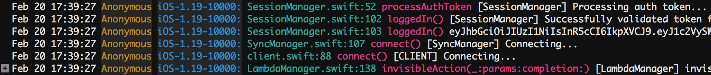

# Swift-native CocoaLumberjack plugin for Papertrail

> NOTE: This project is loosely based on https://bitbucket.org/rmonkey/papertraillumberjack/, thanks to Rogue Monkey 
for writing it!

This project is a simple CocoaLumberjack plugin for Papertrail. It's written in native Swift 4 so it should integrate
well in modern projects.

I did not bother to make a CocoaPod / Carthage or similar package for this: installation is little more than copying
the file to your project. But it has been useful enough to me in several apps now that I felt it might be to others.
So here you are! :)

That said, it does have a few nice features for common use-cases:

1. It takes advantage of Papertrail's ANSI color code support to produce attractive log output (now you can easily see
function names!):

2. Formatting code is simplified. Modular approaches are great for big frameworks, but why instantiate a formatter class
when you can just edit a string in the code?

## Usage

This plugin works much like the Rogue Monkey module:

    var ptLogger = PapertrailLumberjack()
    ptLogger.host = "logs999.papertrailapp.com"
    ptLogger.port = 12345
    ptLogger.tcp = false
    DDLog.add(ptLogger)

Just like the other module, you can also specify programName and machineName. The author uses this to track users as
follows:

    ptLogger.machineName = "Anonymous"

    let build = Bundle.main.object(forInfoDictionaryKey: "CFBundleVersion") as! String
    let version = Bundle.main.object(forInfoDictionaryKey: "CFBundleShortVersionString") as! String
    ptLogger.programName = "iOS-\(version)-\(build)"

Then later, when a user logs in:

    ptLogger.machineName = username

Since Papertrail automatically recognizes both machine and program names (make sure they do not contain spaces!), this
makes it very easy to filter logs for specific builds and/or users.

Enjoy!